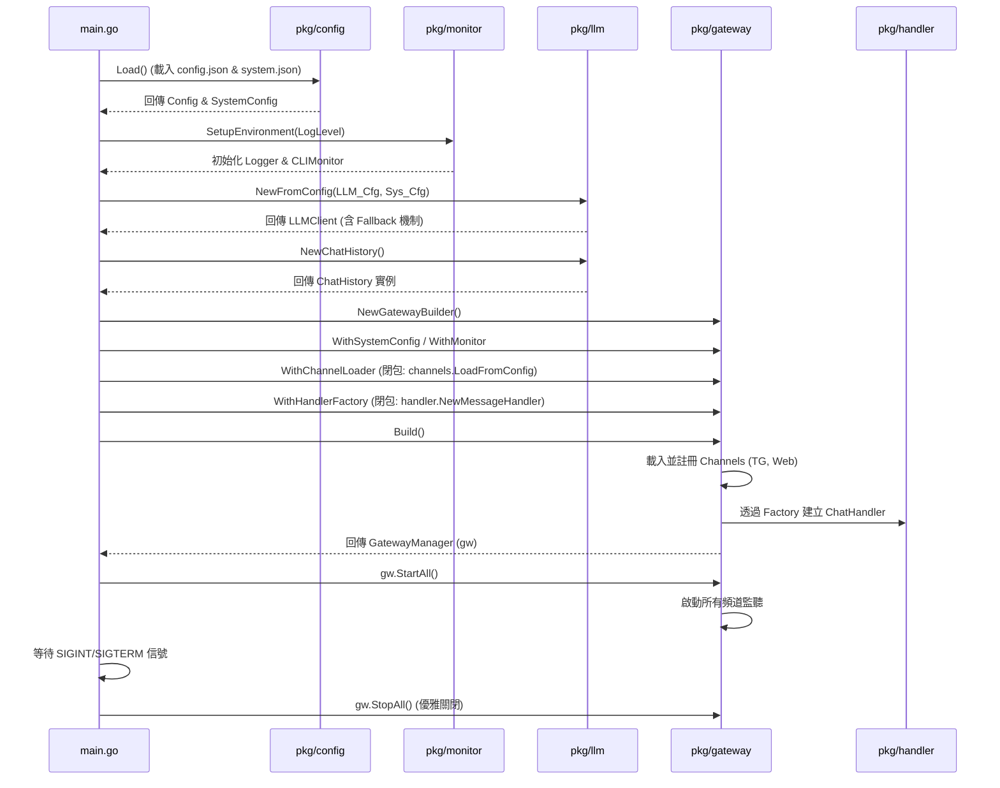
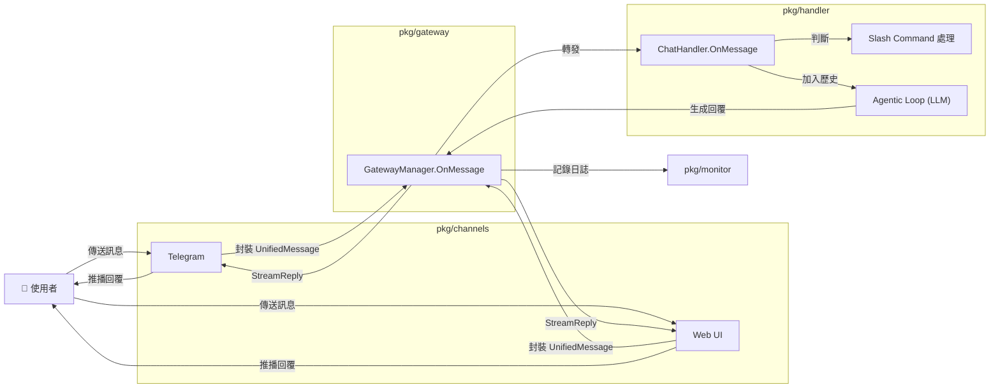
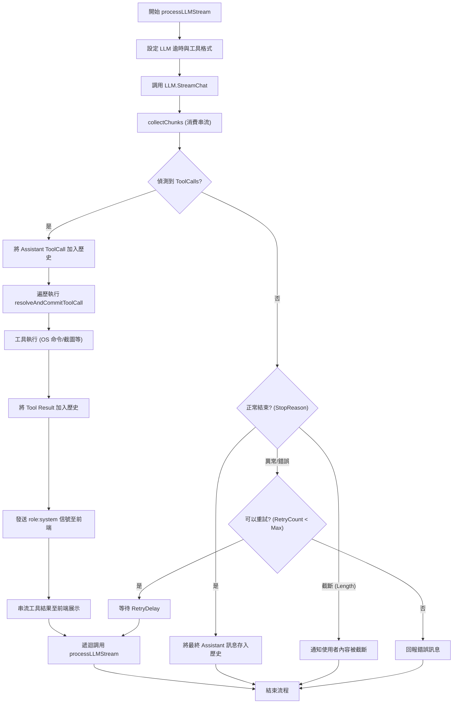
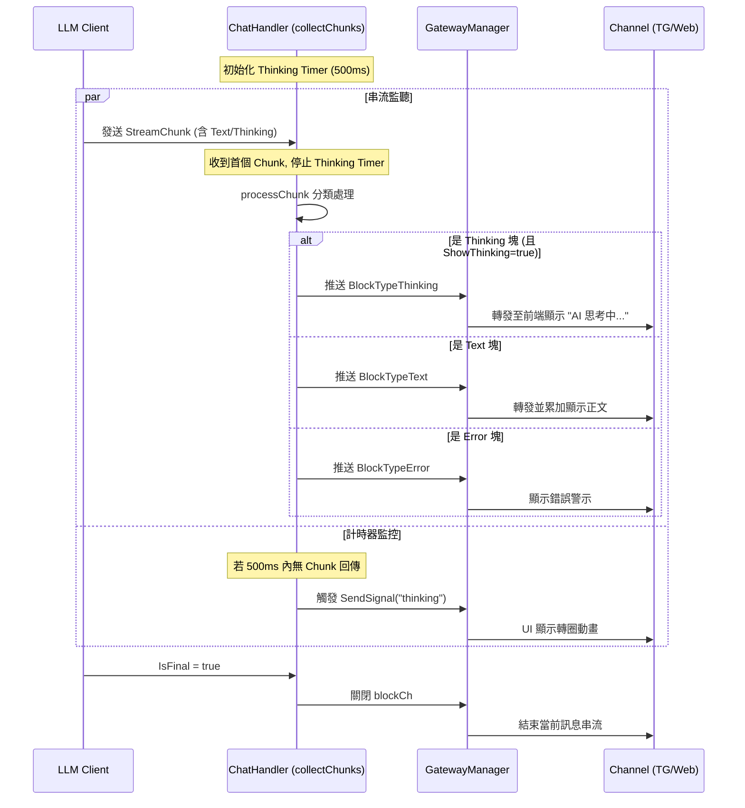

# Genesis 系統功能流程圖總覽

本文件整理了 Genesis 專案中各核心功能的詳細流程圖，涵蓋從系統啟動、訊息路由到 AI 代理執行迴圈的全過程。

---

## 1. 系統啟動流程 (System Startup Flow)

此流程描述了 `main.go` 如何協調各個模塊進行初始化。

---
## 2. 訊息處理管道 (Message Handling Pipeline)

展示使用者訊息從接收到被處理的完整路徑。

---
## 3. 代理執行迴圈 (Agentic Loop & Tool Execution)

核心業務邏輯 `processLLMStream` 的遞迴執行與工具呼叫流程。

---
## 4. 串流與即時回饋 (Streaming & Real-time Feedback)

詳細描述串流塊 (Chunk) 如何被分類並即時推送到使用者介面。

