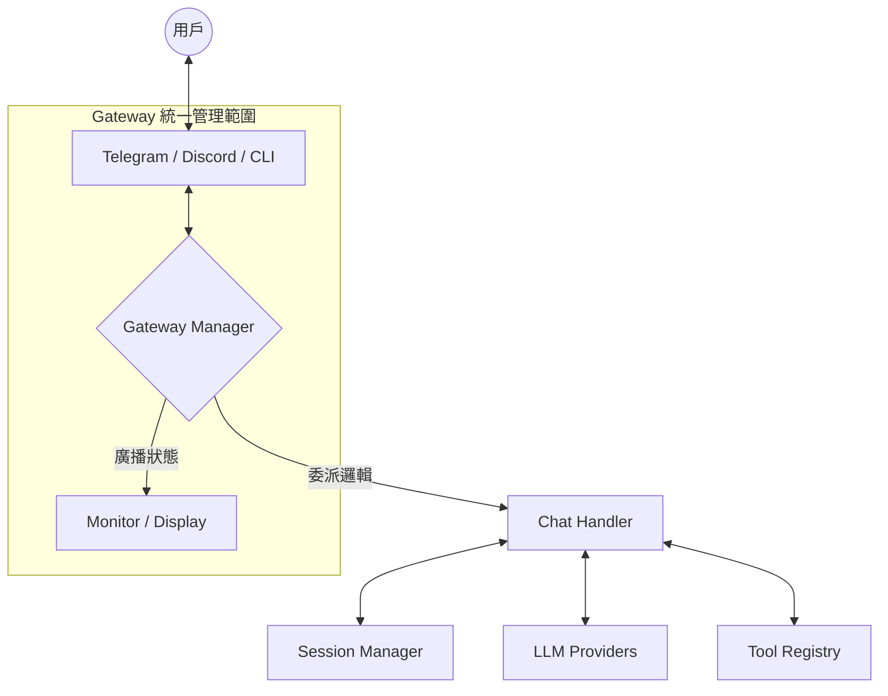
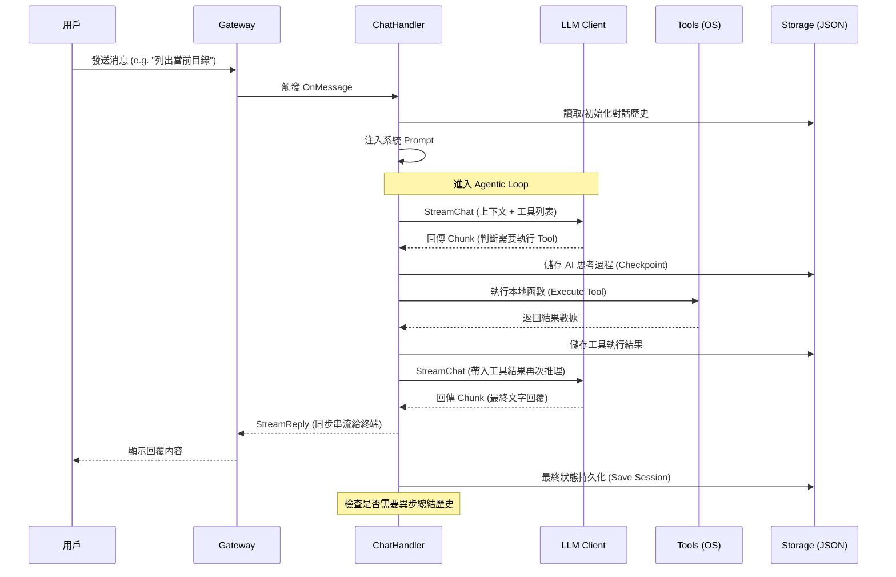
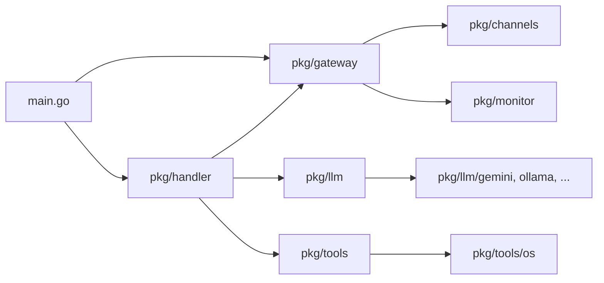

# Genesis 專案架構與運作原理文件

本文件旨在提供 Genesis 專案的深層技術實現細節、核心流程以及架構設計說明。

## 1. 系統整體架構 (System Architecture)

Genesis 採用分層解耦的設計，核心邏輯（Handler）與具體的通訊平台（Gateway/Channels）以及 AI 模型（LLM Providers）完全分離。

### 核心組件說明：
- **Gateway Manager (通訊樞紐)**: 整個系統的「神經中樞」。負責管理所有 Channels 的生命週期、緩衝輸入消息，並將平台差異抹平為 `UnifiedMessage`。
- **Chat Handler (調度器)**: 作為 Gateway 與 AI 之間的橋樑，處理消息的第一手準備（如 ID 生成、上下文初始化），然後將任務委派給 `AgentEngine`。
- **Agent Engine (推理核心)**: 真正的「大腦」。專注於 ReAct 思考循環、工具調用編排、以及自動化的滑動窗口總結（Summarization）。
- **Session Manager (持久化服務)**: 負責對話歷史的磁碟讀寫（JSON）。
- **Tool Registry (工具註冊表)**: 集中管理所有可供 AI 調用的本地功能（如 OS 命令執行）。

---

## 2. 核心初始化順序

系統啟動（`main.go`）遵循以下嚴格順序：

1.  **配置負載**: 讀取 `config.json` 與 `system.json`。
2.  **監控初始化**: 設置 `slog` 與日誌級別。
3.  **模型實例化**: 根據 Provider 配置建立 LLM 客戶端。
4.  **加載頻道與工具**:
    - 初始化 `ChannelSource` 並加載 (`Load`) 配置中的頻道。
    - 建立 OS Tool 與 Worker 實例。
5.  **組建推理鏈**:
    - 實例化 `AgentEngine` 並註冊工具。
    - 建立 `ChatHandler` 綁定引擎。
6.  **組建與啟動 Gateway**:
    - 使用 `GatewayBuilder` 注入所有依賴。
    - 呼叫 `StartAll()` 啟動各通訊管道。

---

## 3. 請求處理流程 (Request Path)

下圖展示了一個完整包含「AI 思考 -> 調用工具 -> 獲得結果 -> 最終回覆」的流程：

---

## 4. 並行與並發模型

- **併發處理**: `ChatHandler.OnMessage` 每接收到一則消息，都會啟動一個 **獨立的 Goroutine**。這意味著 Genesis 能夠同時處理來自不同用戶或不同頻道的請求。
- **異步串流**: 模型生成的回應（Tokens）通過 `Channel` 進行異步傳遞，Handler 負責聚合這些數據並同步更新 UI 狀態（如 Telegram 的「思考中」訊號）。
- **同步持久化**: 為了確保可靠性，所有的 Session 寫入均採用 `sync.RWMutex` 鎖保護。

---

## 5. 模組依賴關係 (Dependency Graph)

---

## 6. 風險分析與設計考量

### 最危險的設計點
1.  **非限制性命令執行 (Unrestricted Exec)**: `run_command` 工具直接接觸操作系統，依賴 AI 的「自覺」來決定不執行危險操作。
2.  **競爭條件 (Race Condition)**: 針對同一 Session 的極短時間連續請求（如兩位用戶在同一個群組對同一個機器人說話），可能導致歷史紀錄互斥覆蓋。
3.  **遞迴深度缺乏硬性限制**: 如果模型陷入工具調用的循環，雖然有 Timeout 緩解，但仍可能產生高昂的 API 費用。

### 潛在的 Production Bug
- **文件 IO 瓶頸**: 當併發用戶量極大時，純 JSON 文件儲存方式會面臨文件鎖（File Lock）爭奪與硬碟 IOPS 壓力。
- **Session 損壞**: 伺服器異常中斷可能導致正在寫入的 JSON 損毀。
- **附件清理 (已實作)**: 在 `pkg/llm/history.go` 的歷史截斷（Truncate）過程中，會同步檢測並刪除不再被引用的磁碟檔案。

---

## 7. 技術債與後續優化建議 (Technical Debt & Roadmap)

### 1. 併發防護機制 (Concurrency Guard)
*   **威脅**: 同一 Session 的併發請求可能導致對話歷史被後完成的請求覆蓋。
*   **優化**: 應在 `SessionManager` 中實施基於 SessionID 的互斥鎖（Mutex Cluster）。

### 2. 工具調用深度限制 (Recursion Depth Limit) ⚠️ 優先級：高
*   **威脅**: 模型若陷入死循環調用工具，會耗盡 Token 額度。目前 `AgentEngine` 尚未實施次數限制。
*   **優化**: 在 `AgentEngine` 的推理循環中實施 `MaxTurns` 計數器。

### 3. 資源清理監控 (Storage GC) ✅ 已實作
*   **現狀**: 同步於對話總結觸發時進行磁碟附件清理。

### 4. 數據交換性能 (IO Performance)
*   **威脅**: 頻繁的 JSON 序列化與 Base64 圖片編解碼在併發高時會產生 CPU/IO 瓶頸。
*   **優化**: 考慮引入更高效的二進位協議（如 Protobuf）或內存緩存層（LRU Cache）來減少磁碟 IO。
