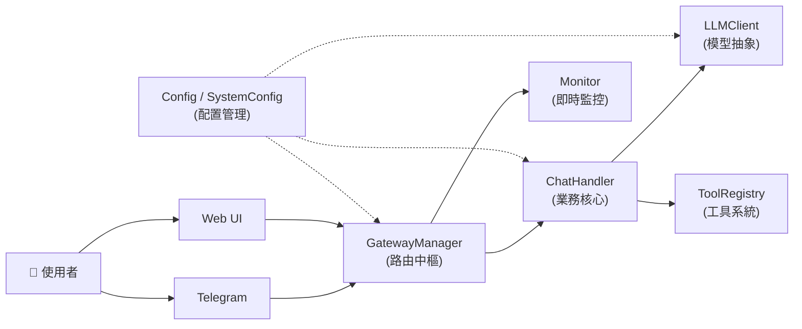
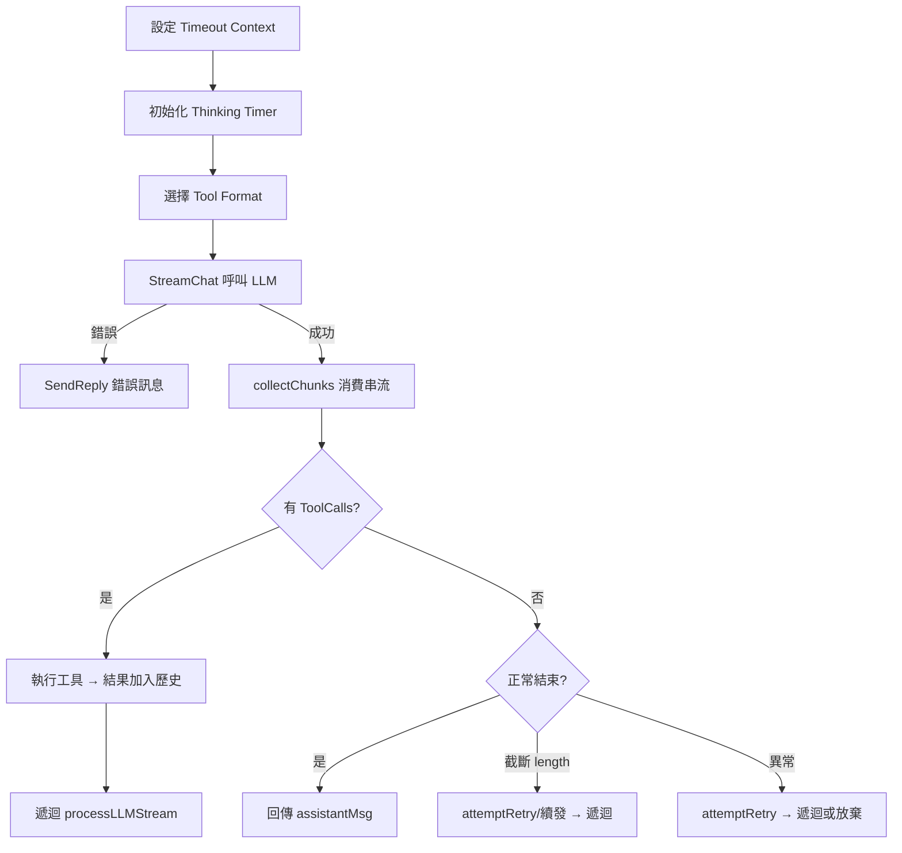

# Genesis 系統功能介紹書

> **版本**：2026-02-10  
> **概述**：Genesis 是一個多平台 AI 對話引擎，支持串流回覆、工具呼叫（Agentic Loop）、多模型故障轉移、以及即時監控。

---

## 系統架構總覽



---

## 1. 入口程式 — `main.go`

**職責**：系統的啟動序列編排器 (Bootstrap Orchestrator)。

### 啟動流程

| 步驟 | 動作 | 說明 |
|:---:|---|---|
| 0 | `monitor.SetupEnvironment()` | 初始化全局日誌格式、打印 Banner、建立 CLI 監視器 |
| 1 | `config.Load()` | 載入 `config.json` + `system.json`，失敗則 Fatalf 終止 |
| 2 | `llm.NewFromConfig()` | 根據配置初始化 LLM 客戶端（或 FallbackClient） |
| 2a | `llm.NewChatHistory()` | 建立對話歷史管理器 |
| 3 | `gateway.NewGatewayBuilder()` | 使用 Builder 模式組裝 Gateway |
| 4 | `signal.NotifyContext()` | 監聽 SIGINT/SIGTERM，優雅關閉 |

### Builder 模式鏈式調用

```go
gw := gateway.NewGatewayBuilder().
    WithSystemConfig(sysCfg).          // 注入引擎參數
    WithMonitor(m).                    // 注入監控器
    WithChannelLoader(func(g) {...}).  // 閉包：載入並註冊頻道
    WithHandlerFactory(func(gw) {...}).// 工廠：建立訊息處理器
    Build()
```

---

## 2. 配置管理 — `pkg/config/`

### `config.go`

**職責**：定義並載入系統的所有可配置參數。

#### 結構體

| 結構體 | 定位 | 來源檔案 |
|---|---|---|
| `Config` | 業務配置（API Key、提示詞、頻道參數） | `config.json` |
| `SystemConfig` | 引擎配置（超時、重試、效能參數） | `system.json` |

#### `Config` 結構體

| 欄位 | 型別 | 說明 |
|---|---|---|
| `Channels` | `map[string]RawMessage` | 各平台的原始 JSON（延遲解析） |
| `LLM` | `RawMessage` | LLM 供應商設定的原始 JSON |
| `SystemPrompt` | `string` | AI 的角色人設指令 |

- **`Validate()`**：檢查 `LLM` 欄位是否為空，缺少則返回錯誤。

#### `SystemConfig` 結構體

| 欄位 | 預設值 | 說明 |
|---|---|---|
| `MaxRetries` | 3 | LLM/網路錯誤最大重試次數 |
| `MaxContinuations` | 5 | 內容因長度截斷時的最大續發次數 |
| `RetryDelayMs` | 500 | 重試間隔（毫秒） |
| `LLMTimeoutMs` | 600000 | LLM 請求硬超時（10 分鐘） |
| `OllamaDefaultURL` | `http://localhost:11434` | Ollama 預設端點 |
| `InternalChannelBuffer` | 100 | Go channel 串流緩衝大小 |
| `ThinkingInitDelayMs` | 500 | 觸發 "thinking" 狀態的初始延遲 |
| `ThinkingTokenDelayMs` | 200 | 串流中偵測暫停的門檻 |
| `TelegramMessageLimit` | 4000 | Telegram 單則訊息上限字數 |
| `DownloadTimeoutMs` | 10000 | 下載外部媒體的超時 |
| `ShowThinking` | `true` | 是否向使用者展示 AI 思考過程 |
| `DebugChunks` | `false` | 是否保存原始串流資料至 `/debug` |
| `EnableTools` | `true` | 全局工具呼叫開關 |

#### 函數

| 函數 | 說明 |
|---|---|
| `Load()` | 讀取 `config.json` → 解析 → 驗證 → 讀取 `system.json` → 回傳 |
| `LoadSystemConfig()` | 讀取 `system.json`，失敗則靜默回退至 `DefaultSystemConfig()` |
| `DefaultSystemConfig()` | 回傳硬編碼的安全預設值 |

---

## 3. Gateway（閘道層） — `pkg/gateway/`

### `builder.go` — 建構器

**職責**：使用 Builder 模式組裝 `GatewayManager`，封裝初始化順序。

| 方法 | 說明 |
|---|---|
| `NewGatewayBuilder()` | 建立空白的 Builder 實例 |
| `WithSystemConfig(cfg)` | 注入 `SystemConfig`（設定 channel buffer 等） |
| `WithMonitor(m)` | 注入監控器實例 |
| `WithChannelLoader(fn)` | 設定頻道載入閉包（`func(*GatewayManager)`） |
| `WithHandlerFactory(fn)` | 設定處理器工廠（`func(*GatewayManager) MessageHandler`） |
| `Build()` | 執行組裝：載入頻道 → 設定 Handler → 啟動所有頻道 |

### `manager.go` — 路由中樞

**職責**：管理所有通訊頻道的生命週期，統一訊息路由。

#### 結構體 `GatewayManager`

| 欄位 | 說明 |
|---|---|
| `channels` | `map[string]Channel` — 已註冊的頻道實例 |
| `msgHandler` | 訊息回調函數（由 Handler 層提供） |
| `monitor` | 監控介面 |
| `channelBuffer` | 串流的內部 Go channel 緩衝大小 |
| `mu` | 讀寫鎖（保護 channels map） |

#### 函數

| 函數 | 說明 |
|---|---|
| `Register(c)` | 註冊新頻道 |
| `GetChannel(id)` | 按 ID 取得頻道 |
| `StartAll()` | 啟動所有頻道，注入 self 作為 `ChannelContext` |
| `StopAll()` | 優雅關閉所有頻道 |
| `SendReply(session, content)` | **語法糖**：將文字包裝成單個 `ContentBlock` 後委託 `StreamReply` |
| `StreamReply(session, blocks)` | 核心串流方法：包裝 channel 以攔截內容供 Monitor 記錄，再轉發給頻道的 `Stream` |
| `SendSignal(session, signal)` | 發送控制信號（如 typing），僅對支持 `SignalingChannel` 的頻道生效 |
| `OnMessage(channelID, msg)` | 實現 `ChannelContext`：記錄日誌 → 廣播 Monitor → 轉發 Handler |

### `types.go` — 介面與資料結構

#### 介面

| 介面 | 方法 | 說明 |
|---|---|---|
| `Channel` | `ID()`, `Start()`, `Stop()`, `Send()`, `Stream()` | 通訊平台的標準生命週期 |
| `SignalingChannel` | `SendSignal()` | 可選擴展：支持 UI 控制信號 |
| `ChannelContext` | `OnMessage()` | 頻道向 Gateway 回報訊息的回調 |

#### 資料結構

| 結構體 | 說明 |
|---|---|
| `UnifiedMessage` | 統一的訊息格式（Session + Content + Files + 控制旗標） |
| `FileAttachment` | 檔案附件（Filename + MimeType + Data） |
| `SessionContext` | 路由資訊（ChannelID + UserID + ChatID + Username） |

---

## 4. 頻道系統 — `pkg/channels/`

### `registry.go` — 頻道工廠註冊表

**職責**：維護平台名稱到 `ChannelFactory` 的全局映射。

| 函數 | 說明 |
|---|---|
| `RegisterChannel(name, factory)` | 註冊工廠（通常在 `init()` 中調用） |
| `GetChannelFactory(name)` | 按名稱查詢工廠 |

#### `ChannelFactory` 介面

```go
type ChannelFactory interface {
    Create(rawConfig, history, system) (Channel, error)
}
```

### `loader.go` — 頻道動態載入器

**職責**：遍歷配置中的頻道列表，透過工廠模式動態建立並註冊頻道。

- **`LoadFromConfig(gw, configs, history, system)`**：
  1. 遍歷 `configs` map
  2. 查找對應的 `ChannelFactory`
  3. 調用 `factory.Create()` 建立實例
  4. 調用 `gw.Register()` 註冊

### `autoload/` — 自動註冊

透過 `_ "genesis/pkg/channels/autoload"` 的空Import，在編譯期間透過 `init()` 自動將所有已知的頻道工廠（Web、Telegram）註冊到全局 Registry。

---

## 5. 業務核心 — `pkg/handler/handler.go`

**職責**：對話流程編排器，實現核心的 **Agentic Loop**。

### 結構體 `ChatHandler`

| 欄位 | 說明 |
|---|---|
| `client` | LLM 客戶端介面 |
| `gw` | GatewayManager（用於回覆訊息） |
| `history` | 對話歷史管理器 |
| `config` | 業務配置 |
| `systemConfig` | 引擎配置 |
| `toolRegistry` | 工具註冊表 |

### 函數總覽

| 函數 | 說明 |
|---|---|
| `NewMessageHandler(...)` | 工廠函數：初始化 Handler → 註冊工具 → 設定歷史 → 回傳閉包 |
| `initializeHistory()` | 若歷史為空，注入系統提示詞作為首條訊息 |
| `OnMessage(msg)` | **入口**：攔截 Slash → 構建 User Message → 觸發 LLM → 保存結果 |
| `processLLMStream(msg)` | **核心迴圈**：超時控制 → 串流 → 工具執行遞迴 → 錯誤重試 → 續發 |
| `collectChunks(...)` | 串流消費器：兩階段處理（等首 chunk + 批量處理）→ 組裝 Message |
| `processChunk(...)` | 單 chunk 路由：text / thinking / image / error 分流處理 |
| `handleSlashCommand(msg)` | Slash 命令處理：解析 → 工具查找 → 執行 → 回傳結果 |
| `attemptRetry(...)` | **輔助**：統一重試邏輯，控制 RetryCount 並通知使用者 |
| `convertToolResult(res)` | **輔助**：將 `tools.ToolResult` 轉換為 `[]llm.ContentBlock` |

### `processLLMStream` 核心流程



---

## 6. LLM 抽象層 — `pkg/llm/`

### `llm.go` — 客戶端介面

#### `LLMClient` 介面

| 方法 | 說明 |
|---|---|
| `Provider()` | 回傳供應商名稱（`"gemini"`, `"ollama"`） |
| `StreamChat(ctx, messages, tools)` | 發起串流對話，回傳 `<-chan StreamChunk` |
| `IsTransientError(err)` | 判斷錯誤是否為瞬態（可重試） |
| `SetDebug(enabled)` | 開啟/關閉原始串流資料的磁碟持久化 |

#### `FallbackClient` 故障轉移

- 包裝多個 `LLMClient`，按優先順序嘗試
- 每個客戶端可重試 `MaxRetries` 次
- 支援指數退避（Exponential Backoff）

### `loader.go` — LLM 工廠載入器

- **`NewFromConfig(rawLLM, system)`**：
  1. 解析 JSON 為 `[]ProviderGroupConfig`
  2. 按 type 查找 `ProviderFactory`
  3. 建立原子客戶端
  4. 單一客戶端直接回傳，多個則包裝為 `FallbackClient`

### `messages.go` — 訊息資料模型

| 結構體 | 說明 |
|---|---|
| `Message` | 對話訊息（Role + Content Blocks + ToolCalls + Usage） |
| `ContentBlock` | 內容原子單元（text / thinking / image / error） |
| `StreamChunk` | 串流片段（增量內容 + 工具呼叫 + 使用量 + 錯誤） |
| `ToolCall` | LLM 發起的工具呼叫請求 |
| `ImageSource` | 圖片資料（支持 base64 序列化） |
| `ChatHistory` | 對話歷史緩衝區（帶讀寫鎖的 Message 切片） |

### `registry.go` — LLM 供應商註冊表

與 Channel 相同的 Factory 模式，透過 `autoload/` 自動註冊 Gemini、Ollama 等供應商。

---

## 7. 工具系統 — `pkg/tools/`

### `tool.go` — 工具介面與註冊表

#### `Tool` 介面

| 方法 | 說明 |
|---|---|
| `Name()` | 工具唯一識別符 |
| `Description()` | LLM 用來決定何時使用此工具的描述 |
| `Parameters()` | JSON Schema 的 `properties` 定義 |
| `RequiredParameters()` | 必填欄位列表 |
| `Execute(args)` | 執行工具邏輯，回傳 `*ToolResult` |

#### `ToolRegistry`

| 方法 | 說明 |
|---|---|
| `Register(tool)` | 註冊工具 |
| `Get(name)` | 查詢工具 |
| `ToGeminiFormat()` | 轉換為 Gemini API 格式 |
| `ToOllamaFormat()` | 轉換為 Ollama/OpenAI 格式 |
| `ToAnthropicFormat()` | 轉換為 Anthropic API 格式 |

### `controller.go` — 控制器模式

| 介面/結構體 | 說明 |
|---|---|
| `Controller` | 通用插件控制介面（`Execute(ActionRequest)` + `Capabilities()`） |
| `ActionRequest` | 標準化動作請求（Action + Params） |
| `ActionResponse` | 動作執行結果（Success + Data + Error） |

### `os_tool.go` — OS 控制工具

實現 `Tool` 介面，內部委託 `os.OSWorker`（`Controller` 介面）執行：
- `run_command`：執行系統命令
- `screenshot`：截取螢幕畫面

---

## 8. 監控系統 — `pkg/monitor/`

### `monitor.go` — 監控介面

| 元素 | 說明 |
|---|---|
| `MonitorMessage` | 監控訊息封包（Timestamp + Type + Channel + Username + Content） |
| `Monitor` 介面 | `Start()` / `Stop()` / `OnMessage()` |
| `SetupEnvironment()` | 統一初始化：`Startup()` + `NewCLIMonitor()` |

### `cli_monitor.go` — 終端機監控器

- 將所有 USER / ASSISTANT 訊息以帶時間戳的格式輸出到 `os.Stdout`
- 使用 ANSI 顏色碼標示時間戳

### `logger.go` — 全局日誌系統

- `Startup()`：打印 ASCII Banner、設置全局 `log` 前綴格式
- 劫持 Go 標準 `log` 輸出格式

---

## 9. 代碼審查與優化紀錄

> **審查日期**：2026-02-10
> **審查範圍**：`pkg/` 下全部模塊（channels、llm、tools、monitor）
> **編譯驗證**：全部通過 `go build ./...`

### 9.1 `pkg/channels/` 頻道系統

#### 審查檔案清單

| 檔案 | 行數 | 結論 |
|---|---|---|
| `registry.go` | 35 | ✅ 無需修改 — 標準 Factory 註冊表 |
| `loader.go` | 41 | ✅ 無需修改 — 動態載入邏輯清晰 |
| `autoload/init.go` | 9 | ✅ 無需修改 — 空 import 自動觸發 init |
| `web/factory.go` | 35 | ✅ 無需修改 |
| `web/web_channel.go` | 266 | ⚠️ 已修改 |
| `telegram/factory.go` | 37 | ✅ 無需修改 |
| `telegram/telegram_channel.go` | 383 | ⚠️ 已修改 |

#### 修改 1：Telegram `Stream` 字串拼接 → `strings.Builder`

- **問題**：`thinkingBuffer += block.Text` 和 `textBuffer += block.Text` 在高頻串流場景下，每次拼接都產生新字串副本，造成不必要的記憶體分配
- **修改**：改用 `strings.Builder`（`thinkingBuf` / `textBuf`），使用 `.WriteString()` 追加、`.Len() > 0` 檢查空值、`.String()` 取出、`.Reset()` 清空
- **影響**：減少 GC 壓力，特別是在長回覆場景

#### 修改 2：Telegram `Stream` 移除冗餘條件

- **問題**：`case "text", "error":` 分支內部再次檢查 `block.Type == "text" || block.Type == "error"`，邏輯重複
- **修改**：直接去掉冗餘判斷，簡化為 `if thinkingBuf.Len() > 0 && !thinkingSent`
- **影響**：代碼可讀性提升

#### 修改 3：Web `json.Marshal` 錯誤處理

- **問題**：三處 `json.Marshal` 呼叫的 error 被 `_` 忽略
- **修改**：
  - `SendSignal`：回傳 `fmt.Errorf("failed to marshal signal: %w", err)`
  - `Stream`：`log.Printf` 記錄錯誤並 `continue` 跳過該 block
  - `handleWebSocket`（history）：`log.Printf` 記錄錯誤，跳過 `WriteMessage`

---

### 9.2 `pkg/llm/` LLM 抽象層

#### 審查檔案清單

| 檔案 | 行數 | 結論 |
|---|---|---|
| `llm.go` | 171 | ✅ 無需修改 — 介面設計清晰，FallbackClient 故障轉移邏輯完整 |
| `messages.go` | 315 | ⚠️ 已修改 |
| `history.go` | 44 | ✅ 無需修改 — RWMutex 深拷貝回傳，完美 |
| `registry.go` | 43 | ✅ 無需修改 — 標準 Factory + Registry |
| `loader.go` | 78 | ✅ 無需修改 — 動態載入 + FallbackClient 包裝正確 |
| `gemini/factory.go` | 28 | ✅ 無需修改 — API Key × Model 笛卡爾積 |
| `gemini/client.go` | 393 | ⚠️ 已修改 |
| `ollama/factory.go` | 32 | ✅ 無需修改 |
| `ollama/client.go` | 414 | ⚠️ 已修改 |

#### 修改 4：`messages.go` 字串拼接 → `strings.Builder`

- **問題**：`GetTextContent()` 和 `GetThinkingContent()` 使用 `result += block.Text`，多 block 場景低效
- **修改**：改用 `strings.Builder`
- **影響**：與 Telegram 的修改動機相同

#### 修改 5：`messages.go` MarshalJSON 安全性修復

- **問題**：`ImageSource.MarshalJSON()` 手動拼接 JSON 字串（`"{\"type\":\"base64\",...}"`），若 `MediaType` 或 `URL` 包含引號或特殊字元會導致 JSON 注入或格式錯誤
- **修改**：定義內部 `alias` 結構體，使用標準 `json.Marshal(a)` 序列化
- **影響**：消除潛在的 JSON 格式錯誤風險

#### 修改 6：Gemini/Ollama Debug 檔案 I/O 優化

- **問題**：迴圈內每個 stream chunk 都執行 `os.OpenFile → Write → Close`，一次串流可能有數百個 chunk，造成大量系統呼叫
- **修改**：在迴圈前開啟一次 `debugFile`，使用 `defer debugFile.Close()` 在 goroutine 結束時統一關閉
- **影響**：減少數百次 `open/close` 系統呼叫，降低磁碟 I/O 開銷
- **適用檔案**：`gemini/client.go` 和 `ollama/client.go` 使用完全相同的修改模式

#### 修改 7：Gemini `useThought` 參數正式啟用

- **問題**：`NewGeminiClient(apiKey, model, useThought)` 接受 `useThought bool` 參數，但該值從未被保存或使用。`ThinkingConfig` 始終硬編碼為 `IncludeThoughts: true`
- **修改**：
  1. 將 `useThought` 保存到 `GeminiClient` 結構體
  2. `StreamChat` 中根據 `g.useThought` 動態決定是否傳入 `ThinkingConfig`
- **影響**：`config.json` 中的 `use_thought_signature` 設定現在可以正確控制思考模式的開關

#### 修改 8：Ollama Thinking + Text 拼接分隔符

- **問題**：`convertMessages` 中 `Content: thinkingContent.String() + textContent.String()` 直接拼接，兩段內容之間沒有分隔符
- **修改**：當兩者都有值時加入 `\n` 換行符作為分隔
- **影響**：改善可讀性，避免思考和正文內容黏在一起

---

### 9.3 `pkg/tools/` 工具系統

#### 審查檔案清單

| 檔案 | 行數 | 結論 |
|---|---|---|
| `controller.go` | 29 | ✅ 無需修改 — 完美的 Action Dispatching 抽象 |
| `tool.go` | 152 | ✅ 無需修改 — 三格式轉換（Gemini/Ollama/Anthropic） |
| `os_tool.go` | 222 | ✅ 無需修改 — ActionSpec 模式優秀，高度解耦 |
| `roles.go` | 10 | ✅ 無需修改 — 角色常量定義 |
| `utils.go` | 14 | ✅ 無需修改 — Base64 輔助函數 |
| `os/worker_windows.go` | 155 | ⚠️ 已修改 |
| `os/worker_darwin.go` | 104 | ✅ 無需修改 |
| `os/worker_linux.go` | 106 | ✅ 無需修改 |

#### 設計觀察

- 本模塊是整個項目中設計最乾淨的部分
- `Controller` 介面 + `ActionSpec` 分派 + `OSTool` 橋接的三層設計高度解耦
- 新增動作（如 `browse`、`edit_file`）只需在 `osActionRegistry` 添加新的 `ActionSpec` 條目
- 三平台 Worker 遵循一致的 `Execute → switch → 專用方法` 模式

#### 修改 9：Windows 截圖臨時檔路徑統一

- **問題**：`takeScreenshot()` 使用 `tempFile := "temp_screenshot.png"` 相對路徑，寫入 CWD。而 Darwin 和 Linux 使用絕對路徑 `/tmp/screenshot.png`。若程式崩潰，截圖檔殘留在專案目錄
- **修改**：改用 `filepath.Join(os.TempDir(), "genesis_screenshot.png")`
- **影響**：三平台行為統一，殘留檔案不再汙染專案目錄

---

### 9.4 `pkg/monitor/` 監控系統

#### 審查檔案清單

| 檔案 | 行數 | 結論 |
|---|---|---|
| `monitor.go` | 40 | ✅ 無需修改 |
| `cli_monitor.go` | 49 | ✅ 無需修改 |
| `logger.go` | 69 | ✅ 無需修改 |

#### 設計觀察

- 極簡但高效：三個檔案、三個職責（介面定義、終端輸出、日誌格式化）
- `CLIMonitor.OnMessage` 根據 `MessageType` 切換顯示格式（ASSISTANT → `[AI]`，其它 → `[Channel/User]`）
- `customLogger` 實現 `io.Writer` 介面攔截 Go 標準 `log` 輸出，加上自定義時間戳
- `Startup()` 單一函數完成 Banner + Logger 初始化
- **此模塊無任何可優化之處**

---

### 9.5 修改總覽

| # | 檔案 | 分類 | 問題描述 | 修改方式 |
|:---:|---|---|---|---|
| 1 | `telegram_channel.go` | 性能 | `thinkingBuffer += block.Text` 字串拼接 | `strings.Builder` |
| 2 | `telegram_channel.go` | 簡化 | `case` 內冗餘 type 判斷 | 移除重複條件 |
| 3 | `web_channel.go` | 健壯性 | `json.Marshal` error 被 `_` 忽略（3 處） | 回傳 / log / skip |
| 4 | `messages.go` | 性能 | `result += block.Text` 字串拼接 | `strings.Builder` |
| 5 | `messages.go` | 安全性 | `MarshalJSON` 手動拼接 JSON 字串 | 結構體 + `json.Marshal` |
| 6 | `gemini/client.go` | 性能 | Debug 檔案每 chunk 都 open/close | 單次開啟 + defer |
| 7 | `gemini/client.go` | 功能 | `useThought` 參數未使用 | 保存到結構體並動態套用 |
| 8 | `ollama/client.go` | 性能 | Debug 檔案每 chunk 都 open/close | 同修改 6 |
| 9 | `ollama/client.go` | 正確性 | thinking + text 直接拼接無分隔 | 條件式加入 `\n` |
| 10 | `worker_windows.go` | 一致性 | 截圖臨時檔寫入 CWD 而非 temp | `os.TempDir()` |
